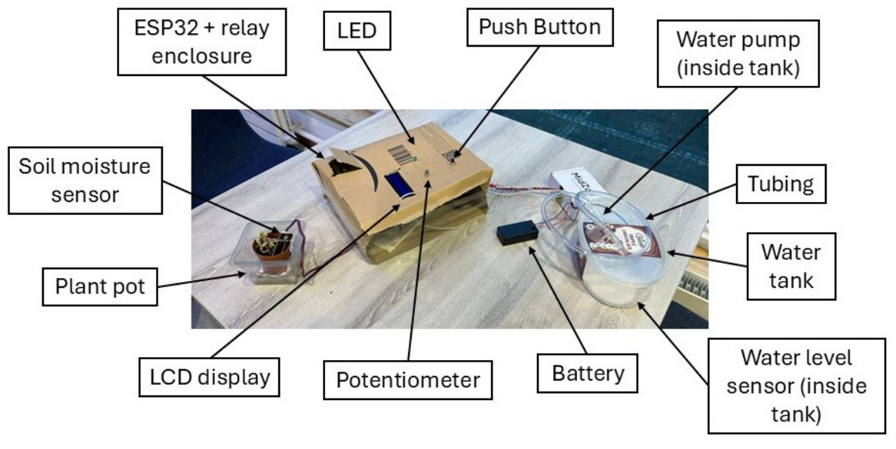
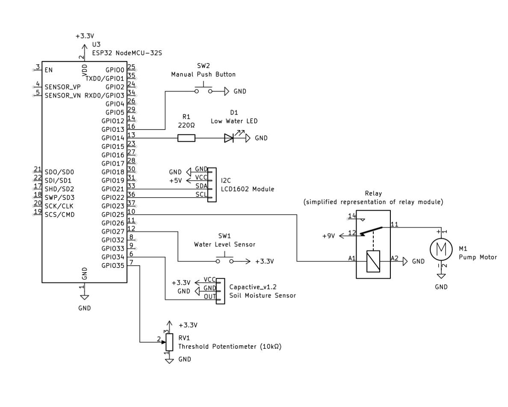
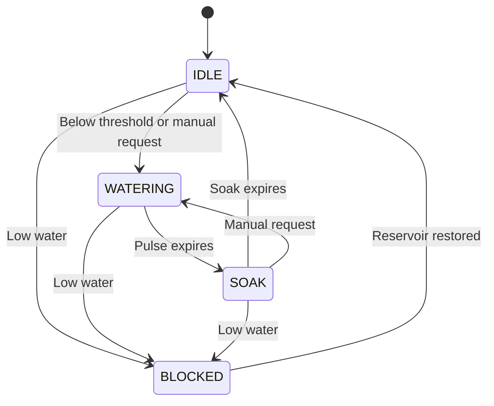
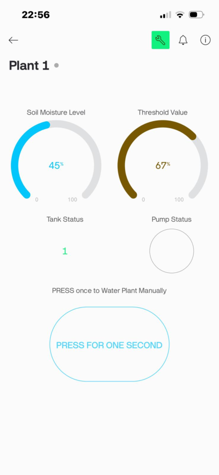

# IoT Self-Watering Plant System

An ESP32-based prototype that monitors soil moisture, waters a plant automatically and provides remote monitoring and manual watering through Blynk.

**Second-year Electrical and Electronic Engineering group project | Group 42 | 2026**

## Overview

The system combines a capacitive soil moisture sensor, a reservoir-level input and a relay-controlled pump. A potentiometer sets the watering threshold locally, while a 16×2 I2C LCD displays moisture, threshold, tank status and pump state. A push button and the Blynk app allow manual watering.

The prototype was developed using C++, the Arduino framework and PlatformIO. This repository documents the completed group project using figures and firmware listings recovered from its final report.

## Main features

- Automatic watering based on a locally adjustable moisture threshold.
- Timed pump pulses followed by a soak period before another automatic decision.
- Low-reservoir interlock that stops the pump and blocks automatic and manual watering.
- Local LCD feedback and a flashing low-water warning LED.
- Manual watering from a physical button or the Blynk app.
- Remote soil moisture, reservoir, pump and threshold monitoring.
- Modular firmware for sensing, switching, indication and watering control.

## My contribution — Surjo Datta

The report's individual contribution record attributes the following work to me:

- Constructing the replacement breadboard prototype following an ESP32 failure.
- Testing Blynk connectivity and the system's inputs and outputs.
- Contributing to app design and connection, code validation, and hardware/software integration.
- Organising weekly meetings and documenting progress in the logbook.
- Contributing to the poster, blog, report writing, proofreading and bench demonstration.

This was a team project. Qinyang Zheng contributed the ESP32 control code, Wi-Fi troubleshooting, software testing and debugging. Stephen Chesterman contributed circuit design, soldering, power and wiring, and physical assembly. The full system and firmware are presented as group work.

## Hardware

| Component | Role |
| --- | --- |
| ESP32 NodeMCU-32S | Embedded controller and Wi-Fi connection |
| Capacitive soil moisture sensor v1.2 | Analogue soil moisture input |
| Water level sensor / float-switch input | Detect low reservoir level |
| Single-channel relay module | Switch the pump supply |
| Mini submersible pump | Deliver water to the plant |
| 16×2 I2C LCD | Display local system status |
| 10 kΩ potentiometer | Adjust the watering setpoint |
| Push button | Request a manual watering pulse |
| Red LED | Indicate low water |
| External 9 V battery | Pump supply used in the prototype |
| Breadboard, wiring, reservoir and tubing | Prototype assembly and water delivery |

The report describes the reservoir sensor inconsistently as a resistive sensor and a float switch. The firmware uses a digital input with HIGH meaning low water; its exact hardware model is not established here.

## Circuit and GPIO mapping

| ESP32 GPIO | Connection |
| --- | --- |
| 34 | Soil sensor analogue output |
| 35 | Threshold potentiometer |
| 27 | Reservoir-level input; HIGH = low water |
| 25 | Relay control |
| 14 | Low-water warning LED |
| 13 | Manual button; active LOW, internal pull-up |
| 21 | LCD I2C SDA |
| 22 | LCD I2C SCL |

The documented LCD address is `0x3F`. The relay switches the external pump supply. An earlier wiring fault damaged an ESP32, so this is a prototype schematic: supply separation and protection require further verification before replication.

## Control sequence

1. Read soil voltage and smooth it with an exponential moving average: `filtered = 0.9 × previous + 0.1 × new`.
2. Read the reservoir status. Low water stops the pump and enters `BLOCKED`.
3. In `IDLE`, compare the filtered soil voltage with the potentiometer-derived threshold.
4. If the soil is below threshold, enter `WATERING` and run the pump for a timed pulse.
5. Stop the pump and enter `SOAK`, allowing water to distribute before the next automatic decision.
6. Return to `IDLE`; recover from `BLOCKED` when the reservoir is refilled.

The final configuration lists **1-second pulses** for both moderate and severe dryness, followed by a **9-second soak**. The two thresholds therefore preserve a structure for different pulse lengths, but do not deliver different doses in this version. Manual requests can interrupt the soak period; requests during watering do not extend the active pulse.

The firmware's moisture percentage is a linear, clamped mapping between **0.80 V (0%)** and **2.00 V (100%)**. It is a relative indicator for this setup, not a validated measurement of volumetric water content.

## Blynk interface

| Virtual pin | Function |
| --- | --- |
| V0 | Soil moisture percentage |
| V1 | Reservoir status: 1 = OK, 0 = LOW |
| V2 | Pump state: 1 = ON, 0 = OFF |
| V10 | Display the locally selected threshold |
| V11 | Request manual watering |

The setpoint is adjusted through the physical potentiometer. The app displays it and provides manual watering. A portable router provided a compatible 2.4 GHz access point during the demonstration after earlier connectivity attempts failed.

## Reported test results

The following are approximate observations recorded in the report, rather than new measurements or independently reproduced results.

| Test | Reported observation |
| --- | --- |
| Automatic watering at a 45% setpoint | Approximately 32% before the first pulse, 42% after its soak, and 51% after the second cycle |
| Subsequent check | Approximately 47% after about 10 minutes, with no further watering triggered |
| Remote manual watering | Approximately 1–2 seconds from app command to pump activation |
| Low-reservoir condition | Pump disabled; automatic and manual requests blocked |
| Reservoir restored | Normal operation resumed without a reset |
| Relay switching | Approximately 30 switching cycles without missed triggers reported |

Testing was limited to short bench sessions and one plant-pot configuration. Long-term operation and performance across different soils, plants and pot sizes were not established.

## Engineering lessons and limitations

- **Power-domain design:** a wiring fault damaged an ESP32 and required reconstruction of the prototype. Future hardware should include verified supply routing and suitable protection.
- **Integration and fault finding:** rebuilding on a breadboard helped the team restore and test individual functions.
- **Network compatibility:** a dedicated 2.4 GHz access point enabled the IoT demonstration.
- **Sensor calibration:** readings depend on the soil and sensor placement; the displayed percentage is an approximate indicator.
- **Mechanical reliability:** breadboard wiring is suitable for a bench prototype, but needs improvement for sustained use.
- **Validation:** pump flow, battery life, extended operation and different plant configurations need further testing.

## Documentation and firmware

- [Technical report extract](docs/technical-report.pdf) — original technical chapters and references; assessment forms and student IDs are omitted.
- [Original firmware listings](docs/source-code-listings.pdf) — Appendix C from the report, with account-specific configuration removed or replaced.
- [Documentation notes](docs/documentation-notes.md) — discrepancies between report prose, figures and code.

The original editable source files and `platformio.ini` were not supplied. Firmware is therefore preserved as PDF listings; this repository is not yet a verified, directly buildable PlatformIO project. The listings cover `config.h`, `main.cpp`, the watering controller, soil sensor, relay, water-level input and indicator LED.

## Future development

- Recover the original source files and PlatformIO configuration.
- Correct and verify threshold/hysteresis behaviour against measured tests.
- Recalibrate for the intended soil and fixed sensor position.
- Measure pump flow and choose appropriate doses for the pot.
- Validate protected power supplies and improve wiring or PCB construction.
- Test prolonged operation and network-loss behaviour.
- Add historical logging and investigate multi-plant support.

## Credits

**Group 42:** Surjo Datta, Stephen Chesterman and Qinyang Zheng. Supervised by Dr Raja Munira.

Photos, diagrams, observations and firmware listings are reproduced from the group's final report, dated 3 April 2026. This repository presents a student engineering prototype and its documented limitations.
